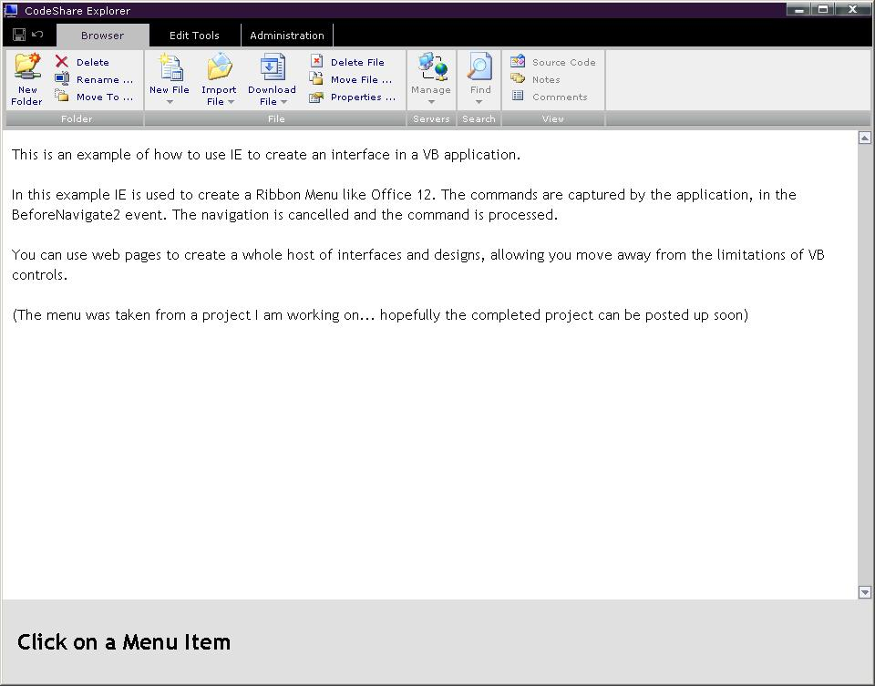



## HTML Menu

### Description

This project shows how to use HTML pages in VB applications. This application uses the IE control and an HTML page, to mimic the look and feel of the new Office 12 Ribbon Menu.
 
### More Info
 

             |
---                |---
**Submitted On**   |2006-06-29 21:41:28
**By**             |[Gandutron](https://github.com/Planet-Source-Code/PSCIndex/blob/master/ByAuthor/gandutron.md)
**Level**          |Advanced
**User Rating**    |5.0 (15 globes from 3 users)
**Compatibility**  |VB 5\.0, VB 6\.0, VB Script
**Category**       |[Internet/ HTML](https://github.com/Planet-Source-Code/PSCIndex/blob/master/ByCategory/internet-html__1-34.md)
**World**          |[Visual Basic](https://github.com/Planet-Source-Code/PSCIndex/blob/master/ByWorld/visual-basic.md)
**Archive File**   |[HTML\_Menu2003526292006\.zip](https://github.com/Planet-Source-Code/gandutron-html-menu__1-65815/archive/master.zip)

